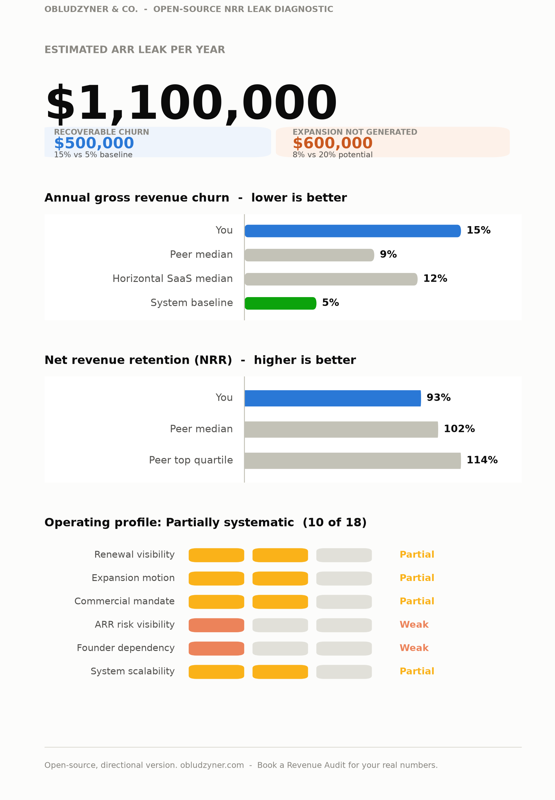

# NRR Leak Diagnostic (open-source edition)

A 7-question, zero-dependency tool that estimates how much ARR a B2B SaaS company is leaking to churn and undergenerated expansion, benchmarked against peer and industry medians.

This is an open-source, self-hostable version of the diagnostic at [obludzyner.com/diagnostic](https://obludzyner.com/diagnostic). Same 7 questions, same formula, same benchmark sources. Run it in your own terminal, drop it into Claude as a skill, or wire it into your own GPT. Nothing you enter is sent anywhere.

<p align="center">
  
</p>

<p align="center"><sub>Real output for a $5M ARR company at 15% churn, 8% expansion - not a mockup. Reproduce it: <code>python3 diagnostic.py --arr 5000000 --churn 15 --expansion 8 --q1 1 --q2 1 --q3 1 --q4 2 --q5 2 --q6 1 --json | python3 render_chart.py /dev/stdin out.png</code>. Full data: <a href="examples/sample_result.json">sample_result.json</a>.</sub></p>

## What you get

- **A headline number** - estimated ARR leak per year, split into recoverable churn and expansion not generated
- **Two benchmark charts** - your churn and NRR plotted directly against peer median, peer top quartile, and industry medians
- **An Operating Profile** - a 6-dimension, 0-18 scored read on how systematic your post-sales motion actually is, banded from Systematic to Critical
- **Three ways to run it** - a zero-dependency CLI, a Claude Skill, or your own Custom GPT, all sharing the exact same formula

## Why this project

Most "free ROI calculator" lead magnets are a black box: you get a number, you don't get the method. This one is the opposite. The formula, the benchmark sources, and the scoring logic are all in this repo, in plain Python, so you can verify the math yourself, adapt it to your own baseline assumptions, or run it entirely offline.

## How to run it

The diagnostic logic (`diagnostic.py`) is pure Python standard library, zero installs:

```bash
# Interactive (asks you the 7 questions)
python3 diagnostic.py

# Non-interactive (for scripting, or for an agent/skill to call)
python3 diagnostic.py --arr 5000000 --churn 15 --expansion 8 \
    --q1 1 --q2 1 --q3 1 --q4 2 --q5 2 --q6 1 \
    --svg result.svg --json
```

`--q1` through `--q6` map to the 6 qualitative questions in order (renewal visibility, expansion motion, commercial mandate, ARR risk visibility, founder dependency, system scalability), each scored 0 (best) to 3 (worst) based on which of the 4 options fits. See `diagnostic.py` for the exact option text. The `--svg` flag produces a lightweight, dependency-free chart.

For the full dashboard shown above (the hero number, stat tiles, and the operating-profile scorecard), pipe the JSON into `render_chart.py`, which uses matplotlib:

```bash
pip install matplotlib
python3 diagnostic.py --arr 5000000 --churn 15 --expansion 8 \
    --q1 1 --q2 1 --q3 1 --q4 2 --q5 2 --q6 1 --json > result.json
python3 render_chart.py result.json dashboard.png
```

This split is deliberate: the numbers you can audit and the logic you'd hand to an agent have zero dependencies; the presentation layer opts into matplotlib because that is what it takes to render something worth sharing.

Example output for a $5M ARR company at 15% churn, 8% expansion: [`examples/sample_dashboard.png`](examples/sample_dashboard.png) (the full dashboard), [`examples/sample_result.svg`](examples/sample_result.svg) (the zero-dependency chart), [`examples/sample_result.json`](examples/sample_result.json) (the raw data).

## Run it as a Claude Skill

See [`skill/SKILL.md`](skill/SKILL.md). Drop the `skill/` folder into your Claude Code or Claude Desktop skills directory, then just ask: *"run the NRR leak diagnostic on my company."* Claude will ask you the 7 questions conversationally and call this script to compute the result.

## Run it as your own GPT

See [`gpt/CUSTOM_GPT_INSTRUCTIONS.md`](gpt/CUSTOM_GPT_INSTRUCTIONS.md) - paste it into a Custom GPT's instructions field (with Code Interpreter enabled) and it will replicate the same question flow, formula, and chart, running entirely inside your own ChatGPT.

## Method and sources

- Recoverable churn is measured against a **5% annual churn baseline**, and expansion potential against **20% of portfolio ARR per year** - the working assumptions Obludzyner & Co. uses for B2B SaaS companies up to $10M ARR with a functioning post-sales system. Change `CHURN_BASELINE` and `EXPANSION_POTENTIAL` in `diagnostic.py` if you want to model a different assumption.
- NRR is approximated as `100 - churn% + expansion%`.
- Peer benchmarks are directional medians compiled from the **SaaS Capital 2025 Retention Survey**, the **Benchmarkit 2025 B2B SaaS Performance Metrics report**, and **ChartMogul** benchmark data. Your own cohort data is always the better benchmark than any of these - treat them as context, not a target.

## Where this fits in SHIFT

This is the "S" of the [SHIFT Method](https://obludzyner.com/#how): a Theory-of-Constraints-based Revenue Audit that finds exactly where NRR is leaking, before anything else gets installed. Proof it works at full depth, not just as a 7-question estimate: at **Clicktale**, the audit surfaced that 60% of revenue up for renewal that quarter was already churning. 7 months later: 95% GRR, 115% NRR across a $10M portfolio -- the same diagnostic instinct this tool automates, applied to a real portfolio instead of self-reported answers.

## What this is not

This is the free, directional version. It does not replace a Theory-of-Constraints-based Revenue Audit that identifies the *specific* bottleneck draining your NRR - that requires looking at your actual account-level data, not 7 multiple-choice answers. If your number here is uncomfortable, that's the point of the tool. The next step is a real audit, not a bigger spreadsheet.

---

**Obludzyner & Co.** - Post-sales advisory for B2B SaaS. We install a commercial operating system that protects ARR and generates expansion in 90 days, without replacing your team or making you the bottleneck. [obludzyner.com](https://obludzyner.com) | [Start the full diagnostic](https://obludzyner.com/diagnostic) | [Book a conversation](https://obludzyner.com/#contact)
